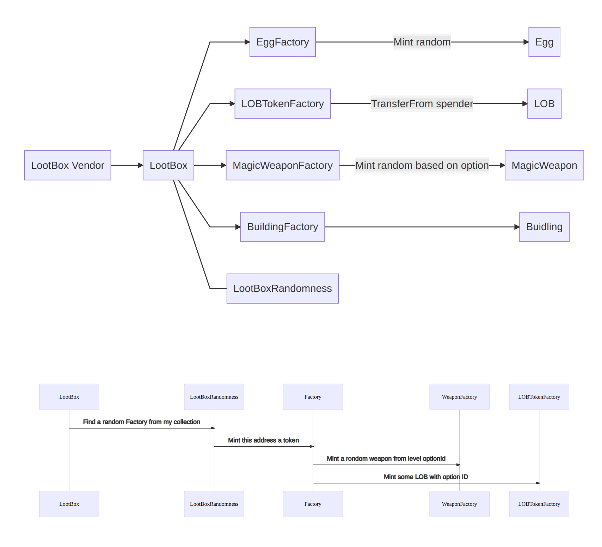
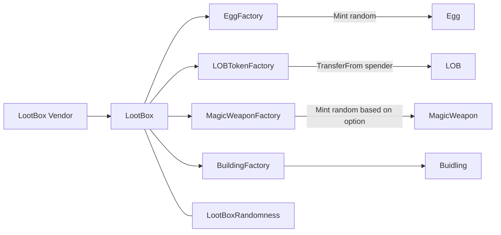
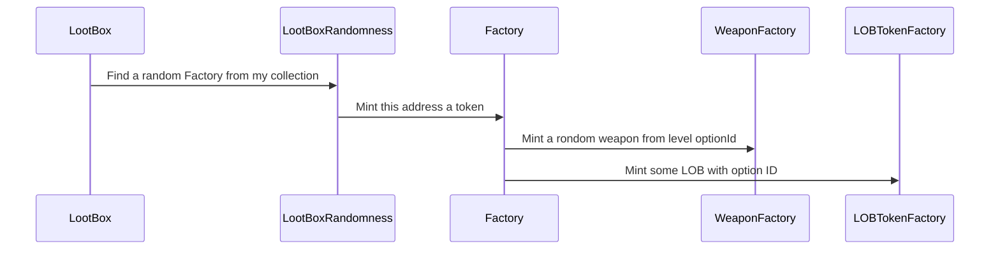

# Setup

Setup truffle development environment, you can install [Ganache](https://trufflesuite.com/docs/ganache/) to run local Etheruem net

```
npm install -g truffle
npm install

# env vars
cp .secret.json.example .secret.json

# run tests
truffle test

truffle compile
truffle deploy --network development --reset
```

# Design

## Egg Faucet

`EggFactory` is the faucet, it can mint one random egg for any address by calling the `mintTo(address)` function.

The chain of minting is `EggFactory` (`mintTo`)=> `Egg` (`hatch`)=> `HatchingEgg` (`breakUp`)=> `Dragon`

The `HatchingEgg` is time locked, it can only turn into a Dragon after a delay

Ownership is transfer on deployment, there is no other way to direct mint intermediate tokens

Check the [tests](test) for more details


## LootBox

`LootBox` is itself a ERC1155 token, the TokenId correspond to the rareness, in ascending order

`LootBox` is minted (purchased) via `LootBoxVendor`, which acts as an vendor machine. Three currencies can be used to purchase the lootboxes,
Ether, USDT and LOB. The price are independently set by the contract owner. In the future if we have a LOB pool,
we can bind the token price to USDT price via an oracle.
Buy request is reverted if the price is not set or set to 0.

`LootBox` delegate the actual minting of assets to Factories, which implements a `IERC1155` style mint [API](contracts/interfaces/IERC1155Factory.sol)
`mint(uint256 _optionId, address _to, uint256 _amount, bytes memory _data)`

The factories decides if they will mint a random `ERC1155` assets based on the `_optionId` or transfer an `ERC20` token, they can also mint `ERC721` assets.

Sometimes the "level" of `ERC721` assets is decided by from which `ERC1155` token they are minted from, this association can be obtained offline by listening to
an mint event the `ERC721` [contract](contracts/interfaces/IERC721MintWithOption.sol) emits,
   please checkout this [worker](metaapi/worker.js) for a demonstration.

`LootBox` uses a pseudo random number generator to decide which reward should be given, the probabilities of each "class" can be set via the
`setProbabilitiesForOption` API, fixtures are located in the [setup script](lib/setupLootboxes.js), the "seed" number can be updated by the owner
to increase the difficulty of attacks.

## Diagrams







### Example

Let's assume S Box has three factories, their probability marked as `[50, 30, 20]`
Because factories can be duplicated, their corresponding optionId
changes, therefore there is a mapping from Box ID to factory, and Box ID to
factory option ID, e.g. `[0, 0, 1]`, the factory+optionId combination is
related to a option in lootbox

### Tokens list

* ERC20

LOBToken => LOB通证

* ERC1155

Egg => 神兽蛋

HatchingEgg => 孵化中的神兽蛋

MagicWeapon => 法器

LootBox => 盲盒

* ERC721

Dragon => 神兽

Building => 房屋
